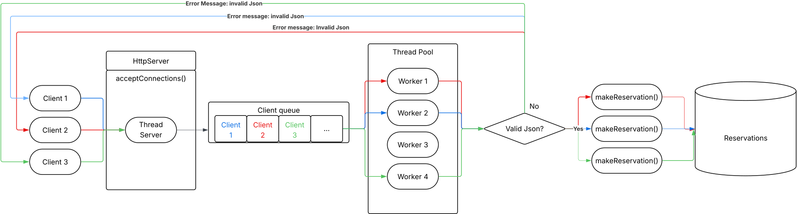

= Architecture & Design

This document provides a detailed overview of the internal architecture and design patterns used in the Network Log Processing system.

== System Overview

The system follows a layered architecture with clear separation of concerns:

1. *Network Layer*: HTTP server handling socket operations
2. *Concurrency Layer*: Thread pool for task distribution
3. *Task Layer*: Polymorphic task execution
4. *Processing Layer*: Request processing and business logic
5. *Storage Layer*: Database integration (future)

== Core Components

=== HttpServer

The main server component responsible for:

* Socket acceptance and management
* Signal handling (SIGINT, SIGTERM, SIGTSTP)
* Thread-safe lifecycle management

[source,cpp]
----
class HttpServer {
    asio::io_context ioc;           // I/O context
    tcp::acceptor acceptor;         // Socket acceptor
    ThreadPool threadPool{4};        // 4 concurrent workers
    std::atomic<bool> shouldStop;   // Graceful shutdown flag
};
----

*Key Responsibilities:*
- Accept incoming TCP connections
- Enqueue client connections as tasks to the ThreadPool
- Coordinate graceful shutdown via signal handlers

=== ThreadPool

The concurrency backbone providing:

* Fixed number of reusable worker threads (default: 4)
* Thread-safe task queue management
* Automatic worker synchronization

The ThreadPool solves a critical problem in network servers: **naive thread creation**. Without a thread pool, a server that creates one thread per incoming connection will crash when handling thousands of concurrent requests. This is because:

1. Thread creation/destruction has significant overhead (time and memory)
2. Modern systems can only sustain hundreds of active threads
3. Context switching with thousands of threads destroys CPU cache locality
4. Memory footprint of thousands of stacks becomes prohibitive

Instead, ThreadPool maintains a *fixed* set of reusable worker threads. When work arrives, it goes into a queue. Idle workers take work from the queue, execute it, and wait for the next task. This approach:

* Limits concurrency to a manageable level
* Eliminates thread creation overhead
* Keeps the CPU cache warm
* Uses predictable memory (workers × stack size)

[source,cpp]
----
class ThreadPool {
    BlockingQueue<std::unique_ptr<Task>> clientsQueue;
    std::vector<std::thread> workers;
    
    void workerLoop() {
        while (true) {
            auto task = clientsQueue.pop();
            if (!task) break;
            task->execute();
        }
    }
};
----

*Design Pattern:* Producer-Consumer with thread pooling

[cols="1,1"]
|===
|*Aspect*|*Implementation*

|Concurrency Model
|Fixed thread pool (4 workers)

|Task Distribution
|BlockingQueue with condition variables

|Resource Management
|std::unique_ptr for automatic cleanup

|Scalability
|Reuses threads instead of creating per-request

|Memory Efficiency
|O(workers) instead of O(requests)

|Worker Synchronization
|Condition variables prevent busy-waiting
|===

=== BlockingQueue<T>

Generic, thread-safe queue template providing:

* Lock-based synchronization with mutex
* Condition variable signaling
* Blocking pop with graceful shutdown support

The BlockingQueue is a fundamental synchronization primitive that enables the producer-consumer pattern. The HttpServer (producer) enqueues client connections, while ThreadPool workers (consumers) dequeue and process them.

What makes BlockingQueue special is the *blocking pop* operation. When a worker calls `pop()` and the queue is empty, the worker automatically blocks (sleeps) without consuming CPU. When an item is enqueued, a blocked worker wakes up and processes the item. This is far more efficient than busy-waiting with `while (queue.empty()) { sleep(1); }`.

Additionally, BlockingQueue supports graceful shutdown: when `stop()` is called, all blocked workers are woken, and no new items can be enqueued. This allows the server to shut down cleanly—all workers process remaining tasks and then exit.

[source,cpp]
----
template <typename T>
class BlockingQueue {
    std::queue<T> queue;
    std::mutex mtx;
    std::condition_variable cv;
    std::atomic<bool> stopped;
    
public:
    void push(T request);
    bool pop(T& request);  // Blocks until available
    void stop();           // Graceful shutdown
};
----

*Thread Safety Guarantees:*

* All public methods are protected by a single mutex
* The condition variable prevents lost wakeups
* The `stopped` flag allows detecting shutdown requests
* Move semantics enable efficient transfer of large objects

*Why Template Design:*

BlockingQueue is a template `BlockingQueue<T>` because queues can contain any type:
- Currently: `BlockingQueue<std::unique_ptr<Task>>`
- Future: `DatabaseTask`, `LoggingTask`, etc.

This generic design means BlockingQueue can be reused for different purposes without code duplication.

=== Task (Polymorphic Interface)

Base abstract class defining the task execution contract:

[source,cpp]
----
class Task {
public:
    virtual ~Task() = default;
    virtual void execute() = 0;  // Pure virtual
};
----

*Design Pattern:* Strategy pattern with virtual dispatch

=== ClientConnection

Concrete implementation of Task handling HTTP request processing:

[source,cpp]
----
class clientConnection : public Task {
    tcp::socket clientSocket;
    beast::flat_buffer socketBuffer;
    http::request<http::string_body> httpRequest;
    
public:
    explicit clientConnection(tcp::socket socket);
    void execute() override;  // HTTP processing logic
};
----

*Responsibilities:*
- Read HTTP request from socket
- Parse request body
- Generate HTTP response
- Handle connection shutdown

== Execution Flow

=== Request Processing Sequence

[plantuml]
----
participant Client
participant HttpServer
participant ThreadPool
participant Worker
participant ClientConnection

Client -> HttpServer: TCP Connection
HttpServer -> HttpServer: accept(socket)
HttpServer -> HttpServer: clientConnection(socket)
HttpServer -> ThreadPool: enqueueTask(clientConnection)
ThreadPool -> BlockingQueue: push(task)
BlockingQueue -> Worker: notify_one()
Worker -> Worker: workerLoop()
Worker -> ClientConnection: execute()
ClientConnection -> ClientConnection: http::read()
ClientConnection -> ClientConnection: http::write()
ClientConnection -> Client: HTTP Response
Worker -> BlockingQueue: wait() next task
----

=== Concurrency Model

For N concurrent requests with M worker threads (M < N):

[source]
----
Main Thread (HttpServer::acceptConnections)
    |
    ├─> Accept connection 1
    ├─> Enqueue ClientTask(socket1)
    ├─> Accept connection 2
    ├─> Enqueue ClientTask(socket2)
    └─> Accept connection N
        Enqueue ClientTask(socketN)

Worker Threads (M pool)
    |
    ├─> Worker1: Execute ClientTask(socket1)
    ├─> Worker2: Execute ClientTask(socket2)
    ├─> Worker3: Wait on BlockingQueue
    ├─> Worker4: Wait on BlockingQueue
    └─> When Worker1 completes
        Worker1: Execute ClientTask(socket3)
----

== Synchronization Mechanisms

=== Atomic Variables

Thread-safe boolean flag for shutdown signaling:

[source,cpp]
----
std::atomic<bool> shouldStop{false};  // Lock-free
----

=== Mutex & Condition Variable

Thread-safe shutdown coordination:

[source,cpp]
----
std::mutex serverMutex;
std::condition_variable cond_var;

// Shutdown sequence
{
    std::unique_lock<std::mutex> lock(serverMutex);
    shouldStop = true;
}
cond_var.notify_all();
----

=== Move Semantics

Efficient transfer of move-only types (sockets):

[source,cpp]
----
tcp::socket currentSocket{ioc};
acceptor.accept(currentSocket);
clientConnection client(std::move(currentSocket));  // No copy
threadPool.enqueueTask(std::move(client));
----

== Design Patterns Used

[cols="1,2,1"]
|===
|Pattern|Purpose|Implementation

|Producer-Consumer
|Task distribution
|HttpServer (producer) → ThreadPool (consumer)

|Thread Pool
|Concurrency management
|Fixed workers instead of per-request threads

|Strategy
|Polymorphic tasks
|Task interface with virtual execute()

|RAII
|Resource management
|Automatic cleanup via destructors

|Singleton
|Signal handling
|Static instance with thread-safe access

|Template
|Generic containers
|BlockingQueue<T> for type safety
|===

== Graceful Shutdown

The server implements signal-aware shutdown:

1. *Signal Reception*: SIGINT, SIGTERM, SIGTSTP trigger handler
2. *State Update*: `shouldStop` flag set atomically
3. *Queue Stop*: BlockingQueue stops accepting new tasks
4. *Worker Termination*: All workers finish current task and exit
5. *Socket Closure*: Acceptor socket closed
6. *Thread Join*: Main thread waits for all workers

[source,cpp]
----
HttpServer::~HttpServer() {
    clientsQueue.stop();           // Signal workers
    for (auto& worker : workers) {
        worker.join();             // Wait for completion
    }
}
----

== Performance Characteristics

=== Throughput

With 4-worker thread pool:

* *Sequential (no pooling)*: ~100-500 req/sec (creates thread per request)
* *With ThreadPool*: ~10,000+ req/sec (reuses threads)
* *Theoretical max*: Limited by I/O and processing logic

=== Memory Usage

* *Per-request overhead*: O(1) with thread pool
* *Fixed memory*: 4 threads × stack size + queue buffers
* *No thread creation/destruction*: Saves allocations

=== CPU Efficiency

* *Context switching*: 4 threads instead of thousands
* *Cache locality*: Worker threads reuse stack
* *Zero busy-waiting*: Condition variables block idle workers

== Future Enhancements

=== DatabaseTask

Separate task type for async database operations:

[source,cpp]
----
class DatabaseTask : public Task {
    std::string logData;
    DatabaseConnection* db;
    
public:
    void execute() override;  // Write to PostgreSQL
};
----

=== Task Priority Queue

Implement priority-based task scheduling:

[source,cpp]
----
BlockingQueue<std::pair<Priority, std::unique_ptr<Task>>> taskQueue;
----

=== Work Stealing

Allow idle workers to steal tasks from busier workers.

=== Metrics & Monitoring

Track:
- Tasks processed per worker
- Queue depth over time
- Worker utilization
- Request latency distribution

== Testing Strategy

=== Unit Tests

Individual component testing with GoogleTest:

[source,bash]
----
make test        # Run all tests
make coverage    # Generate coverage report (90% minimum)
----

=== Concurrency Tests

Multi-threaded scenarios:

[source,cpp]
----
TEST(HttpServer, ConcurrentRequests) {
    // Test with 10+ simultaneous connections
}
----

== Code Organization

[source]
----
src/
├── HttpServer.hpp/cpp         # Main server
├── ThreadPool.hpp             # Worker management
├── BlockingQueue.hpp          # Thread-safe queue
├── TaskInterface.hpp          # Abstract base
├── ClientConnection.hpp/cpp   # HTTP processing
├── Logger.hpp/cpp             # Logging
└── main.cpp                   # Entry point

tests/
├── HttpTest.cpp               # Server tests
└── LoggerTest.cpp             # Logger tests

doc/
├── design/                    # Architecture docs
├── img/                       # Diagrams
└── workflow.adoc              # Git conventions
----

== Related Documentation

* link:../workflow.adoc[Git Workflow & Conventions]
* link:../testing.adoc[Testing Guidelines]
